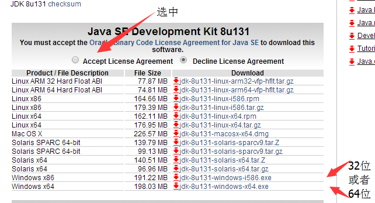

# JxBrowser Crack Please Ref
https://github.com/zhou7758437/JxBrowser-Crack


# Crawer

# 开发

## Version Update
### UpdateMajorVersion
```aidl
build-helper:parse-version versions:set -DnewVersion=${parsedVersion.nextMajorVersion}.0.0 versions:commit
```
### UpdateMinorVersion
```aidl
build-helper:parse-version versions:set -DnewVersion=${parsedVersion.majorVersion}.${parsedVersion.nextMinorVersion}.0 versions:commit
```
### UpdateNextIncrementalVersion
```aidl
build-helper:parse-version versions:set -DnewVersion=${parsedVersion.majorVersion}.${parsedVersion.minorVersion}.${parsedVersion.nextIncrementalVersion} versions:commit
```


## 工具列表
### Intellij
 ### 下载地址
 ```$xslt
 https://download.jetbrains.8686c.com/idea/ideaIU-2017.1.2.exe
 ```
 ### 学生免费账号注册
 ```$xslt
https://www.jetbrains.com/student/
```

### Atom
```$xslt
https://atom.io/
```

## 环境要求
### Java 1.8
```$xslt
http://www.oracle.com/technetwork/java/javase/downloads/jdk8-downloads-2133151.html
```

### Maven
### NodeJS


#
# 使用
## 环境要求
### Java 1.8
```$xslt
http://www.oracle.com/technetwork/java/javase/downloads/jdk8-downloads-2133151.html
```
### 下载文件
```aidl
//JDK 8 64位下载
https://github.com/zhou7758437/jdcrawer/releases/download/1.0/jdk-8u131-windows-x64.exe
//启动脚本
https://github.com/zhou7758437/jdcrawer/releases/download/1.0/start.bat
```

### 执行命令
```$xslt
java -jar jd-serverxxx.jar
```
### 在浏览器输入 localhost:8080 即可访问


